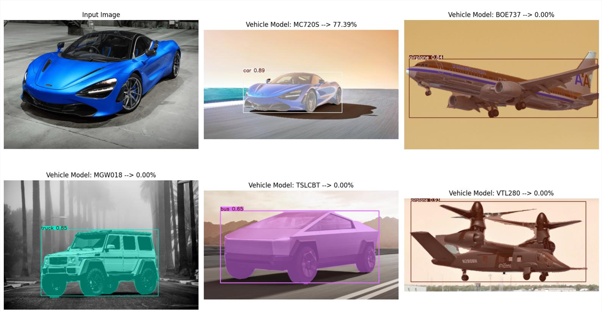

# Image Retrieval System 
## Intro
This  is an Image Retrieval repository, where users can utilize it to view and compare multiple vehicle images from the same or even different vehicles.

This repository uses app.py (main) which contains 3 different pages (classes):
```
1. Register Page: For adding in new vehicle images from existing or new vehicles.
2. Loading Page: Loads the image files and add them into the Output folder as well as writing into the feature_cache.json file.
3. Main Page: Allows the user to view, select, find, delete and compare vehicle images.
```

*Note: Before proceeding, a virtual environment should be created.* 

## A. Register Page
### Pre-requisites
Do ensure that all dependencies have been installed:

```
pip install -r requirements.txt
```


*1). Adding image and directory paths via entry box:*


```
-> This method is best used for users who prefers copy and pasting paths

-> User may copy image paths or directory paths with valid extensions (.jpg, .jpeg, .png) and paste the path onto the entry box

-> User can then press 'Add' to add the image path onto the Drag & Drop Box located just below the entry field.

-> User can also choose to remove unwanted files by clicking the 'trash' icon inside the Drag & Drop Box

-> Once confirmed, user may proceed to the loading page by clicking on the 'Ok' button
```

*2). Adding directory paths via folder selection:*


```
-> This method is best used for users who work on images from the same folder / directory.

-> User may click on the 'folder' icon, located beside the 'Add' button.

-> User may navigate to the particular folder where the images are stored and selects that folder.

-> The selected folder path will appear inside the entry box

-> User then presses 'Add' to add the image path onto the Drag & Drop Box located just below the entry field.

-> User can also choose to remove unwanted files by clicking the 'trash' icon inside the Drag & Drop Box

-> Once confirmed, user may proceed to the loading page by clicking on the 'Ok' button
```

*3). Adding images and directory via drag & drop:*


```
-> This method is best used when users work on several images and directory with differing paths / multiple image folders opened at the same time.

-> Users may then drag image file of their choice or folders directly into the Drag & Drop Box located just below the entry field.

-> User can also choose to remove unwanted files by clicking the 'trash' icon inside the Drag & Drop Box

-> Once confirmed, user may proceed to the loading page by clicking on the 'Ok' button
```

## B. Loading Page

```
-> This page handles the background processing of image data which writes into feature_cache.json.

-> Users will be shown the overall progress with the blue progress bar in the middle of the page.

-> Alongside the progress bar, other information such as overall percentage and number of completed files will also be shown.

-> Once the processing of the images has finished, a pop-up window will appear to notify the user.

-> Clicking the 'Ok' button will direct the user into the 'Main Page'.
```
## C. Main Page


*The Main Page consists of the entry for images that has been added from the Registration and Loading Page.* 

*This page also comprises of the following:*
```
1. Checkboxes: Allows user to select images of the desired vehicle.
2. Vehicle Model: Shows user a list of vehicles that had been added. The user may also click on these vehicle models to view the images.
3. Number of features: These are the number of classes that were detected by the trained .pt model in real-time during the processing of images.
4. Storage date: Contains information on when the images were added as well as the exact timings.
5. Search button: Allows user to search for specific vehicle within the entries. The user may also press 'Enter' key to select the highlighted vehicle.
```
```
6. Select all / Deselect all button: Allows user to select/ deselect all vehicle images inside the entry.
7. Add button: redirects user to the register page to add more images.
8. Delete button: Deletes all selected vehicles and their respective images from the entry and output folder.
9. Compare button: Allows user to compare the desired vehicle against the images stored inside the output folder.
10. Refresh button: Lets the user refresh the entry to get the most updated view.
```
*Shortcuts are implemented inside the Main Page to let user work more efficiently when retrieving images.*

*The available shortcuts are as follows:*
```
1. <Ctrl> + <F> = Shortcut for Search button
2. <Ctrl> + <A> = Shortcut for Select/ Deselect all button
3. <Ctrl> + <D> = Shortcut for Delete button
4. <F5> = Shortcut for Refresh button 
```

## D. Miscellaneous
*List of other files used in this repository (found inside the miscellaneous directory):*

### Feature_cache.json
*This is the file used to store all the images and data using the format as follows:*
```
{Vehicle:{
    image_path_under_output_folder:{
        features:[
            {"class_id":id,
            "center:[x,y],
            "size":[l,h],
            "confidence":number
            },
        ]
    }
}}
```

### Matcher.py
*This is the file responsible for the following functions:*

#### 1. Add new car image
This method is used for handling the addition of single image file as mentioned previously inside the Register Page.

#### 2. Batch processing of images
This method is used for handling the addition of directories containing single or multiple image file(s).
```
# default format in this code is "id-Vehicle_Model_*.jpg", change the code below in matcher.py if you need to change the type of format

for img_file in image_files:
    # Extract vehicle model from filename (adjust parsing logic as needed)
    vehicle_model = img_file.split('_')[0]
    vehicle_model = vehicle_model.split('-')[1]
    if vehicle_model not in vehicle_groups:
        vehicle_groups[vehicle_model] = []
    vehicle_groups[vehicle_model].append(img_file)
```
#### 3. Recognize unknown car
This function will run a similarity calculation that compares the query image and compares it with existing images that were previously registered and written inside feature_cache.json file.
The result of the calculations will pull up the top 5 most similar results as compared to the query image. The results will then be saved and can be found inside "output\\comparison".

#### 4. View stored vehicles
This function will show the list of all registered images found inside "output\\images". The list is sorted in alphabetical manner with respect to their vehicle.

#### 5. View one stored vehicle
Similar to the aforementioned, this function shows only a single registered image of choice instead of the complete list. It utilizes file explorer to open "output\\images\\{vehicle inserted}"  

#### 6. Modify stored vehicle
This function will list out all the registered vehicles as written inside the feature_cache.json file. The user can then choose which specific vehicle they would like to modify and replace the existing vehicle accordingly. The user may also change the filepath if they wishes to do so.

#### 7. Delete stored vehicle
This function aims to delete only one selected vehicle image.

#### 8. Delete vehicles in batches
Similar to the aforementioned, this function lets user delete vehicle images in batches.

### Visualization.py
*This file contains the VisulizationHandler class, which is responsible for creating the layout of images and plot them accordingly. It is then passed onto ImageViewer class, which creates a tkinter window for the user to view the images.*


